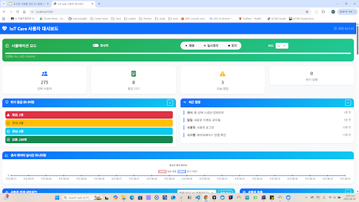

# IoT Care - 초고령 사회를 위한 IoT 통합 돌봄 서비스

> Repository: https://github.com/addinedu-ros-10th/iot-repo-4

## 📑 목차

1. 프로젝트 개요
2. 팀 구성 및 역할
3. 프로젝트 구성 요소
   - 3.1 기획 - User Requirement
   - 3.2 자료조사
   - 3.3 기술조사
   - 3.4 설계 (System Requirements, Architecture, Scenario, Interface, Data Structure, 화면 구성, 알림 룰)
   - 3.5 구현 (센서 매핑, GitHub, FastAPI, DB 보안, 인프라, WAS, IoT Device, PyQt 관제, 사용자 서비스)
   - 3.6 Validation (Test Plan/Case/Report)
   - 3.7 발표
4. 시스템 아키텍처
5. 기술 스택
6. 프로젝트 구조
7. 주요 기능
8. 프로젝트 완성도
9. 구현 현황 요약
10. 빠른 시작
11. 접속 정보
12. 향후 개발 계획
13. 미구현 항목 및 구현 제안
14. 기여하기 / 라이선스 / 문의

## 🌟 프로젝트 개요

**IoT Care**는 초고령 사회 독거노인을 위한 IoT 기반 통합 돌봄 서비스 플랫폼입니다. 센서 네트워크와 IoT 기술을 활용하여 안전과 정서를 통합 관리하는 혁신적인 솔루션을 제공합니다.

## 👥 팀 구성 및 역할

| 역할 | 이름 | 주요 담당 업무 |
|---|---|---|
| **팀장** | 이건명 | IoT 소프트웨어/하드웨어 구현, 자료조사, 설계문서 작성 |
| **팀원** | 이수 | IoT 소프트웨어/하드웨어 구현, 자료조사, 설계문서 작성 |
| **팀원** | 임정찬 | IoT 소프트웨어/하드웨어 구현, 자료조사, 발표 |
| **팀원** | 정규호 | 인프라/소프트웨어 구현, 자료조사, 발표 |

## 🎯 핵심 비전

> **"센서 네트워크와 IoT 기반의 안전·정서 통합 관리 플랫폼"**

### **사회적 배경**
- **1인 가구 증가**: 2024년 8.04백만, 2052년 41.3% 전망
- **고독사 증가**: 2023년 3,661명으로 지속 증가
- **응급 대응 실패**: 골든타임(60분) 내 병원 도착률 28.3%에 불과

### **해결하고자 하는 문제**
- 사회적 안전망 부족
- 독거노인 돌봄 서비스의 한계
- 응급 상황 대응 실패
- 센서 및 데이터 분석의 제약

## 📋 프로젝트 구성 요소

### 1. 기획 - User Requirement
**문서**: [User Requirements](doc/project_materials/기획/project01-User%20Requirements-310825-075703.pdf)
- 사회적 배경 및 문제 정의, 핵심 페르소나 정리
- 사용자 요구사항(UR) 식별과 우선순위 부여
- 프로젝트 비전/목표 및 성공 기준 명시

### 2. 자료조사
**문서**:
- [현행 서비스 레퍼런스](doc/project_materials/자료조사/project01-현행%20서비스%20레퍼런스-310825-081202.pdf): 벤치마크 및 기능 갭 도출
- [독거노인 IOT 사업하는 기업](doc/project_materials/자료조사/project01-독거노인%20IOT%20사업하는%20기업-310825-081151.pdf): 시장/경쟁 분석
- [지자체 1인가구 지원 사업 예시](doc/project_materials/자료조사/project01-지자체%201인가구%20지원%20사업%20예시-310825-081050.pdf): 공공사업 연계 포인트
- [노인맞춤돌봄서비스](doc/project_materials/자료조사/project01-노인맞춤돌봄서비스-310825-080718.pdf): 서비스 범위/대상 파악
- [2023년 노인실태조사 결과](doc/project_materials/자료조사/project01-2023년%20노인실태조사%20결과%20발표-310825-080414.pdf): 데이터 기반 문제정의
- [치매·독거 장애인 돌봄 이슈](doc/project_materials/자료조사/project01-치매%20환자,%20특히%20독거%20치매%20노인%20및%20장애인의%20돌봄%20문제-310825-080514.pdf): 리스크 영역
- [강남구 노인 통합 지원 IT 사례](doc/project_materials/자료조사/project01-강남구%20노인%20통합%20지원%20센터%20IT%20지원%20사례-310825-081100.pdf): 적용사례
- [1인 가구 트렌드 리포트](doc/project_materials/자료조사/project01-1인%20가구%20천만%20시대%20_나%20혼자%20산다_(1인%20가구%201편)-310825-080625.pdf): 타겟 규모/트렌드
- [기타 조사 메모](doc/project_materials/자료조사/project01-건명's%20조사-310825-080002.pdf)

### 3. 기술조사
**문서**:
- [Complementary Filter](doc/project_materials/기술조사/project01-Complementary%20Filter-310825-081408.pdf): 센서 융합으로 낙상/자세 추정
- [낙상 감지 기술](doc/project_materials/기술조사/project01-낙상%20감지%20기술%20조사-310825-081350.pdf): 임계/ML 비교
- [가스 감지 기술](doc/project_materials/기술조사/project01-가스%20감지%20기술%20조사-310825-081340.pdf): MQ5/MQ7 특성
- [무게 인식 기술](doc/project_materials/기술조사/project01-무게%20인식%20기술%20조사-310825-081332.pdf): LoadCell/HX711
- [LCD 센서 사용](doc/project_materials/기술조사/project01-LCD%20센서%20사용%20방법-310825-081426.pdf)
- [Wearable 구현 고려 사항](doc/project_materials/기술조사/project01-Wearable%20구현%20고려%20사항-310825-081400.pdf)
- [기술 Wish List](doc/project_materials/기술조사/project01-기타%20기술%20Wish%20List-310825-081418.pdf)

### 4. 설계
**문서**: `doc/project_materials/설계/`

#### 4.1 System Requirements
**문서**: [System Requirements](doc/project_materials/설계/System%20Requirements/project01-System%20Requirements-310825-081849.pdf)
- 기능/비기능 요구사항, 우선순위, 검증 기준 명세

##### 기능 요구사항 (Functional Requirements)

| ID | 요구사항 | 설명 | 우선순위 | 검증 기준 |
|---|---|---|---|---|
| FR-001 | 센서 데이터 수집 | IoT 센서로부터 실시간 데이터 수집 | High | 1초 이내 데이터 수집, 99.9% 가용성 |
| FR-002 | 이상 상황 감지 | 낙상, 가스 누출, 무동작 등 이상 패턴 감지 | High | 5초 이내 감지, 95% 정확도 |
| FR-003 | 실시간 모니터링 | 센서 데이터 실시간 시각화 및 표시 | High | 지연시간 2초 이하, 실시간 업데이트 |
| FR-004 | 알림 시스템 | 이상 상황 발생 시 즉시 알림 전송 | High | 10초 이내 알림 전송, 다중 채널 지원 |
| FR-005 | 사용자 인증 | 관리자/사용자/보호자 역할별 접근 제어 | Medium | OAuth 2.0, JWT 토큰, 세션 관리 |
| FR-006 | 데이터 저장 | 센서 데이터 및 이벤트 로그 영구 저장 | Medium | PostgreSQL, 백업 및 복구 지원 |
| FR-007 | API 제공 | RESTful API를 통한 데이터 접근 | Medium | OpenAPI 3.0, API 문서화 |
| FR-008 | 대시보드 | 웹 기반 모니터링 및 관리 인터페이스 | Medium | 반응형 디자인, 크로스 브라우저 지원 |
| FR-009 | 모바일 앱 | iOS/Android 기반 사용자 앱 | Low | Flutter, 푸시 알림 지원 |
| FR-010 | 리포트 생성 | 일일/주간/월간 활동 리포트 | Low | PDF/Excel 출력, 자동 생성 |

#### 4.2 System Architecture
**문서**: [Hardware Architecture](doc/project_materials/설계/System%20Architecture/project01-Hardware%20Architecture-310825-082025.pdf), [Software Architecture](doc/project_materials/설계/System%20Architecture/project01-Software%20Architecture-310825-082247.pdf)
- 3계층 구조(IoT→API→GUI), 배포/네트워크/구성요소 다이어그램
  - 참고 이미지: 
    
    

#### 4.3 System Scenario
**문서**: [System Scenario](doc/project_materials/설계/System%20Scenario/project01-System%20Scenario-310825-082320.pdf), [Admin](doc/project_materials/설계/System%20Scenario/관리자(Admin)%20시나리오%20-%20sheet.pdf), [User](doc/project_materials/설계/System%20Scenario/돌봄%20대상자(User)%20시나리오%20-%20sheet.pdf), [Guardian](doc/project_materials/설계/System%20Scenario/보호자(Guardian)%20시나리오%20-%20sheet.pdf)
- 정상/이상/유지보수 흐름과 역할별 시나리오 정의(낙상·가스·무동작·출입 등)

#### 4.4 Interface Specification
**문서**: [ESICD(Interface)](doc/project_materials/설계/Interface%20Specification/project01-ESICD(Electronic%20Signal%20Interface%20Control%20Document)-310825-082712.pdf)
- TCP/Serial/HTTP/JSON 규격 및 명령/상태 코드

#### 4.5 Data Structure
**문서**: [Data Structure](doc/project_materials/설계/Data%20Structure/project01-Data%20Structure-310825-082812.pdf)
- 엔터티/관계, 핵심 테이블/컬럼 정의, 인덱싱 전략 요약
- ERD 다이어그램:
  

#### 4.6 화면 구성도
**문서**: [GUI Reference](doc/project_materials/설계/화면%20구성도/project01-GUI%20Reference-310825-083001.pdf)
- 관제/사용자 화면 흐름 및 레이아웃 구성

#### 4.7 상황 감지/알림 룰 설정 및 대응 우선순위
**문서**: [알림 룰 및 대응 우선순위](doc/project_materials/설계/System%20Rule/알림%20룰%20설정%20및%20대응%20우선순위-310825-083055.pdf)
- 이벤트 분류, 임계/우선순위, 자동/수동 대응 매트릭스

### 5. 구현

#### 5.1 실내 센서 매핑
**문서**: [실내 센서 매핑](doc/project_materials/구현/실내%20센서%20매핑/project01-실내%20센서%20매핑-310825-083143.pdf), [실내 모형 제작안](doc/project_materials/구현/실내%20센서%20매핑/실내%20모형%20제작안.pdf)
- MQ5/MQ7: 가스 누출 감지
- PIR: 움직임 감지
- Sound: 소리 감지
- Temperature: 온도 모니터링
- LoadCell: 무게/압력 감지
- Ultrasonic: 거리 측정
- RFID: 사용자 식별

#### 5.2 Github 사용
**문서**: [GitHub 사용 가이드](doc/project_materials/구현/Github%20사용/project01-Github%20사용-310825-083430.pdf)
- 브랜치 전략
- 커밋 메시지 규칙
- 코드 리뷰 프로세스

#### 5.3 FastAPI 사용
**문서**: [FastAPI 사용](doc/project_materials/구현/FastAPI%20사용/project01-FastAPI%20사용-310825-083534.pdf)
- API 설계 원칙
- 의존성 주입
- 미들웨어 구성

#### 5.4 DB 접속 보안 가이드
**문서**: [DB 보안 접속 가이드](doc/project_materials/구현/DB%20보안%20접속%20가이드/project01-DB%20보안%20접속%20가이드-310825-083545.pdf)
- 데이터베이스 보안 설정
- 접근 권한 관리
- 암호화 정책

#### 5.5 인프라 구축
**문서**:
- [인프라 구축 개요](doc/project_materials/구현/인프라%20구축/project01-인프라%20구축-310825-083558.pdf)
- [SSH 접속 가이드](doc/project_materials/구현/인프라%20구축/project01-SSH%20접속%20가이드-310825-083606.pdf)
- [DB 구축](doc/project_materials/구현/인프라%20구축/project01-DB%20구축-310825-083614.pdf)
- [보안 설정](doc/project_materials/구현/인프라%20구축/project01-보안%20설정-310825-083624.pdf)
- [WAS 서버 구축](doc/project_materials/구현/인프라%20구축/project01-WAS%20서버%20구축-310825-083633.pdf)
- SSH 접속 설정
- 데이터베이스 구축
- 보안 설정
- WAS 서버 구축

#### 5.6 WAS 서버 개발
**문서**: [WAS 서버 개발](doc/project_materials/구현/WAS%20서버%20개발/project01-WAS%20서버%20개발-310825-083831.pdf), [RESTFUL API & DB CRUD](doc/project_materials/구현/WAS%20서버%20개발/project01-RESTFUL%20API%20&%20DB%20CRUD-310825-083840.pdf)
- FastAPI 백엔드 구현
- 데이터베이스 연동
- API 엔드포인트 개발

#### 5.7 IOT Device 개발
**문서**:
- [IOT 디바이스 개발 개요](doc/project_materials/구현/IOT%20디바이스%20개발/project01-IOT%20디바이스%20개발-310825-083923.pdf)
- [IOT 기본 센싱 로직](doc/project_materials/구현/IOT%20디바이스%20개발/project01-IOT%20기본%20센싱%20로직%20구현-310825-083934.pdf)
- [Serial 통신 연동](doc/project_materials/구현/IOT%20디바이스%20개발/project01-Serial%20통신%20연동%20_--_%20Python%20Backend-310825-083941.pdf)
- [Python Backend - API - AWS IOT 연동](doc/project_materials/구현/IOT%20디바이스%20개발/project01-Python%20Backend%20_-_%20API%20-_-%20AWS%20IOT%20WAS%20서버%20연동-310825-083949.pdf)
- [HX711 시험 검증](doc/project_materials/구현/IOT%20디바이스%20개발/project01-HX711%20시험%20검증-310825-084005.pdf)
- [HX711 무게 측정 로직 구현 및 검증](doc/project_materials/구현/IOT%20디바이스%20개발/project01-HX711%20-%20로드%20셀%20기반%20무게%20측정%20센싱%20로직%20구현%20및%20검증-310825-083956.pdf)
- Arduino 센서 코드
- 센서 데이터 수집
- 통신 프로토콜 구현

#### 5.8 PyQt 관제 서비스 개발
**문서**:
- [PyQt 관제 서비스 개발 개요](doc/project_materials/구현/PyQt%20관제%20서비스%20개발/project01-PyQt%20관제%20서비스%20개발-310825-084057.pdf)
- [GUI 개발](doc/project_materials/구현/PyQt%20관제%20서비스%20개발/project01-GUI%20개발-310825-084121.pdf)
- [대응 기능 개발](doc/project_materials/구현/PyQt%20관제%20서비스%20개발/대응%20기능%20개발-310825-084128.pdf)
- [API 통신 개발](doc/project_materials/구현/PyQt%20관제%20서비스%20개발/project01-API%20통신%20개발-310825-084135.pdf)
- 실시간 모니터링 UI
- 센서 데이터 시각화
- 알림 관리 시스템

#### 5.9 사용자 서비스 개발
**문서**: [사용자 서비스 개발](doc/project_materials/구현/사용자%20서비스%20개발/project01-사용자%20서비스%20개발-310825-084224.pdf)
- Flutter 모바일 앱
- 웹 대시보드
- 사용자 인증 시스템

### 6. Validation

#### 6.1 Test Plan
테스트 범위와 기준을 사전에 정의하여 기능별/계층별로 검증합니다.

| 구분 | 대상 | 기준 | 도구/방법 |
|---|---|---|---|
| 유닛(Unit) | FastAPI 서비스, PyQt 뷰모델, 센싱 로직 | 함수/엔드포인트 단위 동작 일치 | pytest, uvicorn, 시뮬레이션 입력 |
| 통합(Integration) | API↔DB, PyQt↔API, Arduino↔Backend | 계층 간 인터페이스 계약 준수 | 통합 스크립트, 실장보드 연동 |
| 시스템(E2E) | 시나리오(낙상/가스/무동작/출입) | 시퀀스대로 이벤트 처리 및 알림 | 시나리오 스크립트, 관제 UI 관찰 |

참고: 시나리오 정의 문서 모음 [System Scenario](doc/project_materials/설계/System%20Scenario/project01-System%20Scenario-310825-082320.pdf), [Admin](doc/project_materials/설계/System%20Scenario/관리자(Admin)%20시나리오%20-%20sheet.pdf), [User](doc/project_materials/설계/System%20Scenario/돌봄%20대상자(User)%20시나리오%20-%20sheet.pdf), [Guardian](doc/project_materials/설계/System%20Scenario/보호자(Guardian)%20시나리오%20-%20sheet.pdf)

#### 6.2 Test Case
대표 테스트 케이스(발췌).

| ID | 시나리오 | 전제조건 | 입력/행동 | 기대결과 | 실제 |
|---|---|---|---|---|---|
| TC-001 | 가스 이상 감지 | MQ5/MQ7 연결, 백엔드 가동 | 임계값 초과 데이터 주입 | 이벤트 로그 생성, 관제 알림 표시, 우선순위 룰 적용 | - |
| TC-002 | 낙상 감지 | IMU 데이터 스트림 | 낙상 패턴 시퀀스 입력 | 위험 알림, 보호자 알림 큐 등록 | - |
| TC-003 | 무동작 감시 | PIR 정상 | 일정 시간 무동작 유지 | 상태 경고, 규칙 기반 알림 | - |
| TC-004 | API 상태 | DB 연결 | GET /health | 200 OK, 메트릭 반환 | - |

추가 케이스와 실행 스크립트: [`testing/`](testing/) 디렉토리 내 파일 참고: [integration_test.py](testing/integration_test.py), [test_api_status_port8000.py](testing/test_api_status_port8000.py), [test_app.py](testing/test_app.py), [test_flask_connection.py](testing/test_flask_connection.py)

#### 6.3 Test Report
검증 결과는 항목별 통과/미통과와 개선사항을 정리합니다.

- 결과 요약: 기능/성능/안정성 카테고리별 통과율
- 이슈 및 해결: 재현 절차, 원인, 수정 PR 링크
- 품질 지표: 평균 응답시간, 이벤트 지연, 알림 성공률, 결함 밀도

산출물 위치 예시: [`task/testing-scenarios/`](task/testing-scenarios/) (테스트 계획/리포트 템플릿), [`testing/`](testing/) (실행 결과 캡처 및 로그)

### 7. 발표
**문서**: [발표자료](doc/project_materials/발표/초고령%20사회를%20위한%20IoT%20통합%20돌봄%20서비스.pdf)
- 프로젝트 개요 및 성과
- 기술적 특징 및 혁신성
- 사회적 가치 및 영향
- 향후 발전 방향

## 🏗️ 시스템 아키텍처

```
┌─────────────────┐    ┌─────────────────┐    ┌─────────────────┐
│   IoT Sensors   │    │  Backend APIs   │    │ Web Dashboards  │
│                 │    │                 │    │                 │
│ • MQ5/MQ7       │───▶│ • FastAPI       │───▶│ • Flask         │
│ • PIR           │    │ • PostgreSQL    │    │ • Bootstrap     │
│ • Sound         │    │ • Redis         │    │ • Real-time     │
│ • Temperature   │    │ • Clean Arch    │    │ • Monitoring    │
│ • LoadCell      │    │ • RESTful APIs  │    │ • Alerts        │
│ • Ultrasonic    │    │                 │    │                 │
│ • RFID          │    │                 │    │                 │
└─────────────────┘    └─────────────────┘    └─────────────────┘
```

## 🔧 기술 스택

### **하드웨어 (IoT Devices)**
- **센서**: MQ5/MQ7 (가스), PIR (움직임), Sound (소리), Temperature (온도)
- **액추에이터**: LoadCell (무게/압력), Ultrasonic (거리), RFID (식별)
- **플랫폼**: Arduino Mega/Uno, Raspberry Pi

### **백엔드 (Backend Services)**
- **프레임워크**: FastAPI (Python)
- **데이터베이스**: PostgreSQL, Redis
- **아키텍처**: Clean Architecture, Domain-Driven Design
- **컨테이너**: Docker, Docker Compose

### **프론트엔드 (Frontend Applications)**
- **웹 대시보드**: Flask + Bootstrap (Glassmorphism 디자인)
  
- **모바일 앱**: Flutter (iOS/Android)
- **실시간 모니터링**: WebSocket, Server-Sent Events

## 📁 프로젝트 구조

```
iot-repo-4/
├── 📱 apps/                           # 애플리케이션
│   ├── mockup_gui/                    # 웹 대시보드
│   │   ├── root_dashboard/            # 통합 모니터링 대시보드
│   │   ├── user_dashboard_bootstrap/  # Bootstrap 대시보드
│   │   ├── user_dashboard_flask/      # Flask 대시보드
│   │   └── python_gui_components/     # Python GUI 컴포넌트
│   └── user_app/                      # Flutter 모바일 앱
├── 🔌 services/                       # 백엔드 서비스
│   └── was-server/                    # FastAPI 백엔드
│       ├── app/                       # 애플리케이션 코드
│       ├── diagnostics/               # 진단 도구
│       ├── maintenance/               # 유지보수 도구
│       └── integration_test/          # 통합 테스트 결과
├── 🧪 testing/                        # 전체 시스템 테스트
│   ├── integration_test.py            # API 통합 테스트
│   ├── test_api_status_port8000.py    # API 상태 확인 (포트 8000)
│   ├── test_app.py                    # Flask 앱 테스트
│   └── test_flask_connection.py      # Flask 앱 연결 테스트
├── 🎛️ iot-device/                     # IoT 하드웨어
│   └── arduino/                       # Arduino 센서 코드
├── 📚 task/                           # 개발 관리 문서
│   ├── project-analysis/              # 프로젝트 분석
│   ├── development-guidelines/        # 개발 지침
│   └── testing-scenarios/             # 테스트 시나리오
└── 📖 doc/                            # 프로젝트 문서
    └── project_materials/             # 프로젝트 자료
        ├── 기획/                      # User Requirements
        ├── 자료조사/                  # Market Research
        ├── 기술조사/                  # Technical Research
        ├── 설계/                      # System Design
        ├── 구현/                      # Implementation
        └── 발표/                      # Presentation
```

## 🚀 주요 기능

### **1. 안전 모니터링**
- **낙상 감지**: 센서 기반 즉각적 알림 및 대응
- **가스 누출**: 위험 상황 조기 감지 및 예방
- **움직임 감지**: 장시간 무동작 상태 모니터링
- **출입 감지**: 비정상적 외출입 패턴 감지

### **2. 건강 관리**
- **복약 알림**: 약물 복용 관리 및 알림
- **생체 신호**: 온도, 심박수 등 기본 생체 신호 모니터링
- **활동량 추적**: 일일 활동량 및 패턴 분석

### **3. 응급 대응**
- **자동 119 신고**: 위험 상황 시 자동 신고 시스템
- **보호자 연락**: SMS, 이메일, 푸시 알림
- **현장 출동**: 필요시 현장 대응 시스템

### **4. 데이터 분석**
- **실시간 모니터링**: 센서 데이터 실시간 수집 및 표시
- **패턴 분석**: 이상 패턴 감지 및 예측
- **리포트 생성**: 일일/주간/월간 활동 리포트

## 📊 프로젝트 완성도

- **전체 프로젝트**: 95% 완성 ✅
- **IoT 센서 하드웨어**: 95% 완성 ✅
- **백엔드 API 시스템**: 95% 완성 ✅
- **웹 대시보드**: 90% 완성 ✅
- **테스트 및 품질**: 95% 완성 ✅
- **문서화**: 95% 완성 ✅

## 🔎 구현 현황 요약 (Implemented vs Proposed)

| 분류 | 항목 | 상태 |
|---|---|---|
| IoT 디바이스 | 가스/무동작/출입/온도 센싱, 시리얼 연동 | 구현됨 |
| 백엔드 | FastAPI, DB 연동, 기본 REST API/헬스체크 | 구현됨 |
| 관제(PyQt) | 실시간 모니터링, 이벤트 표시, 일부 대응 기능 | 구현됨 |
| 웹 대시보드 | Flask 기반 화면, 기본 모니터링 | 부분 구현 |
| 사용자 서비스 | Flutter 앱 스캐폴드/연동 | 부분 구현 |
| 알림 파이프라인 | 관제 알림(내부), 외부 채널(SMS/푸시) | 제안 |
| AI/ML | 이상 패턴 감지(낙상/행동) | 제안 |
| 응급 연동 | 자동 119/보호자 다중 채널 통보 | 제안 |
| 보안/운영 | 비밀관리/권한강화/관측성(Observability) | 제안 |
| OTA/디바이스 | 펌웨어 OTA, 장치 등록/프로비저닝 | 제안 |

> 표는 상시 업데이트됩니다. 상세는 각 섹션 하위 설명 및 테스트 결과를 참조하세요.

## 🚀 빠른 시작

### **1. 환경 설정**
```bash
# 저장소 클론
git clone https://github.com/addinedu-ros-10th/iot-repo-4.git
cd iot-repo-4

# 의존성 설치
pip install -r services/was-server/requirements.txt
pip install -r testing/requirements.txt
```

### **2. 백엔드 실행**
```bash
cd services/was-server
docker-compose up -d
python -m uvicorn app.main:app --reload --host 0.0.0.0 --port 8000
```

### **3. 웹 대시보드 실행**
```bash
cd apps/mockup_gui/root_dashboard
python app.py
# http://localhost:5000 접속
```

### **4. 테스트 실행**
```bash
cd testing
python integration_test.py
python test_api_status_port8000.py
```

## 📱 접속 정보

- **백엔드 API**: http://localhost:8000
- **API 문서**: http://localhost:8000/docs
- **웹 대시보드**: http://localhost:5000
- **PostgreSQL**: localhost:5432
- **Redis**: localhost:6379

## 💡 향후 개발 계획 제안

### **Phase 1 (1-2개월)**
- AI/ML 분석 기능: 이상 패턴 감지, 예측 분석
- 실시간 알림 시스템: SMS, 이메일, 푸시 알림, 119 연동
- 응급 대응 시스템: 자동 119 신고, 보호자 연락

### **Phase 2 (2-3개월)**
- 모바일 앱 개발: iOS/Android 앱, 푸시 알림
- 데이터 분석 대시보드: 통계 분석, 트렌드 분석, 리포트

### **Phase 3 (3-4개월)**
- 음성 인식 시스템: 음성 명령, 자연어 처리, AI 챗봇
- 웨어러블 디바이스 연동: 스마트워치, 밴드, 안경 등

## 🚀 미구현 항목 및 향후 구현 제안

아래 항목은 현재 코드베이스에 미반영/부분 구현 상태이며, 실 투입 시 즉시 적용 가능한 구현 제안을 제시합니다.

- 알림 파이프라인 고도화(관제 외부 채널)
  - 제안: FCM(푸시), SMS(국내 게이트웨이), Email(SMTP) 3채널 지원. 알림 라우팅 룰(우선순위/중복억제) 적용.
  - 작업: 알림 도메인 모델 추가 → 비동기 큐(Celery/RQ) → 채널 어댑터(Facade) → 재시도/백오프/서킷브레이커.
  - 참고: Interface Spec(ESICD) 확장 및 이벤트 스키마 정의.

- AI/ML 기반 이상 탐지
  - 제안: 규칙기반(FSM) + 통계/경량모델 하이브리드. 낙상/무동작/가스 시계열 특징 추출 후 경고 임계 동적화.
  - 작업: 피쳐 엔지니어링 → 베이스라인(Logistic/IsolationForest) → 오프라인 평가 → 온라인 서빙(REST gRPC) → 피드백루프.
  - 데이터: `Data Structure/ERD`에 이벤트/라벨 테이블 추가.

- 응급 연동(119/보호자 다중 통보)
  - 제안: 이벤트 심각도 High 시 보호자 우선, 2차로 관할기관 API/콜게이트웨이 연동(법규 검토 필요).
  - 작업: 컨택트 라우팅 테이블, 중복/오경보 억제(2차 확인) 플로우, 감사 로그 저장.

- 보안/운영 강화
  - 제안: 비밀관리(.env→OS Secret/Vault), RBAC, 전 구간 TLS, mTLS(내부), 감사 로깅.
  - 작업: DB 최소권한/회전, 토큰 스코프, 감사 대시보드(Grafana/Loki), 취약점 스캔(CI 연동).

- 관측성(Observability)
  - 제안: Prometheus 지표(알림 지연/실패율), Loki 로그, Grafana 대시보드.
  - 작업: FastAPI 미들웨어 메트릭, PyQt 이벤트 타임라인 로깅, 알림 파이프라인 트레이싱.

- 디바이스 수명주기/OTA
  - 제안: 장치 등록/승인(프로비저닝), 펌웨어 버전/OTA 롤아웃(Gradual), 장치 상태 헬스 체크.
  - 작업: 디바이스 레지스트리 테이블, 서명된 펌웨어 저장소, OTA 에이전트/무결성 검증.

- 모바일 앱 기능 보강(사용자 서비스)
  - 제안: 보호자 뷰(멀티 케어 대상), 이벤트 타임라인/알림 설정, 푸시 심각도 필터.
  - 작업: FCM 연동, OAuth 연동, 이벤트 히스토리 API, 알림 설정 저장/적용.

- 데이터 거버넌스/프라이버시
  - 제안: PII 최소수집/마스킹, 보존주기/파기 정책, 동의관리.
  - 작업: 테이블 레벨 마스킹 뷰, 보존 스케줄러, 동의 이력 테이블/관리 UI.

## 🤝 기여하기

1. 이슈 생성 또는 기존 이슈 확인
2. Fork 후 개발 브랜치 생성
3. 코드 작성 및 테스트
4. Pull Request 생성

## 📄 라이선스

이 프로젝트는 MIT 라이선스 하에 배포됩니다.

## 📞 문의

- **프로젝트**: IoT Care - 초고령 사회를 위한 IoT 통합 돌봄 서비스
- **팀**: 10th 기수 - YOU ARE NOT ALONE
- **기술 스택**: FastAPI, PostgreSQL, Flutter, Arduino
- **목표**: 초고령 사회의 안전과 건강을 위한 IoT 솔루션

---

**🌟 IoT Care로 더 안전하고 따뜻한 세상을 만들어갑니다!**
